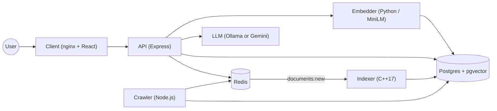
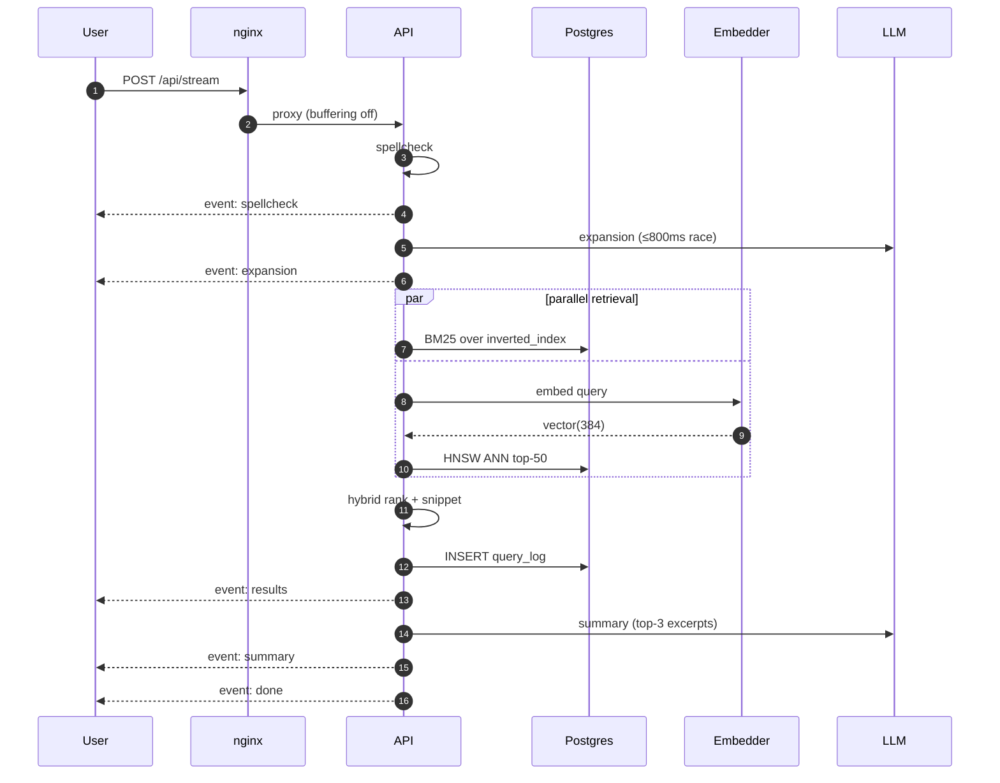

# Surge Engine

A full-stack web search engine over 10,000 Wikipedia articles: hybrid lexical + semantic ranking, streamed responses, AI summaries.


<!-- DEMO -->

<!-- Replace with a screen recording of a real search -->

<!-- SCREENSHOTS -->
<p>
  
  
  
</p>

## What it is

Surge crawls Wikipedia, builds an inverted index and a PageRank graph, embeds every document with a 384-dimensional sentence transformer, and serves hybrid BM25 + cosine + PageRank rankings behind a streaming SSE API and a React SPA. Queries are spell-corrected, intent-classified, and expanded with synonyms before retrieval, the top three results are summarised by an LLM in real time, with the result page becoming interactive before the summary lands. Six containers run on a single Compose network, only nginx (port 80) and the API (port 3001) are exposed. The ranking pipeline returns the first organic result in under two seconds over the full corpus. Every layer: crawler, indexer, ranking engine, and frontend: is built from scratch.

## Architecture



## Tech stack

| Technology | Role |
|---|---|
| Node.js + cheerio | BFS crawler with Redis work queue |
| C++17 + libpqxx + hiredis | Streaming indexer, PageRank, real-time pub/sub consumer |
| Python + sentence-transformers | Batch vectoriser and persistent HTTP embedder |
| PostgreSQL 16 | Documents, links, inverted index, query log |
| pgvector + HNSW | Sub-millisecond ANN search over 9,967 vectors |
| Redis 7 | Crawler queue, pub/sub, autocomplete cache |
| Express.js | Ranking API and SSE streaming endpoint |
| React + Vite | SPA with autocomplete, AI card, score breakdown, analytics |
| Leaflet + OSM | Map card for navigational intent |
| Ollama / Gemini | Local or hosted LLM for query expansion and summaries |
| Docker Compose | Six-service orchestration on one bridge network |
| nginx | Static asset serving and SSE-safe reverse proxy |

## Key engineering decisions

- **Hybrid ranking with per-query normalisation**: BM25, cosine, and PageRank merged at `0.4 / 0.4 / 0.2`.
  Each signal is min-max scaled per query because the raw scales are incomparable and the weights are only meaningful on a common range.

- **Persistent HTTP embedder, not per-request subprocess**: sentence-transformers loaded once at boot.
  Spawning the model per query would add ~3 seconds of cold-start, the embedder runs as its own container and the MiniLM weights are baked into the image.

- **Title trie for autocomplete, inverted index for spellcheck**: two different data structures, two different jobs.
  Suggestions should be real article titles the user can complete, spell correction needs the full term frequency dictionary to find dominant neighbours.

- **Frequency-dominant spellcheck**: corrections fire when a near-neighbour is at least ten times more common.
  Wikipedia content contains misspellings verbatim, so a naive "if-in-dictionary, keep it" rule never corrects anything, dominance over the typed token is the right signal.

- **SSE streaming with per-stage events**: `spellcheck → expansion → results → summary → done`.
  Results render the moment retrieval finishes, the LLM-generated summary fills in behind a shimmer, so perceived latency tracks retrieval, not generation.

- **PageRank in the indexer, not the API**: converged offline, written to a flat table.
  Iterative power method over 10k nodes is cheap once but unacceptable per query, the API does a single `WHERE url = ANY($1)` lookup at request time.

## Search pipeline



## Measured results

| Metric | Value |
|---|---|
| Corpus | 9,967 Wikipedia documents |
| Inverted-index terms | 625,149 |
| Title autocomplete trie | 8,793 entries |
| HNSW ANN top-5 | 0.41 ms |
| PageRank convergence | 14 iterations (δ < 1e-6) |
| Vector encode rate | 136 docs/sec on CPU |
| Time to first result event | ~1.7 s |
| Time to AI summary event | ~3 s (Ollama warm) |

## Run it

```bash
git clone <repo>
cd surge-engine/infrastructure
docker compose up --build
```

Open <http://localhost>.

---
[LinkedIn](https://www.linkedin.com/in/shivanshtripathii/) · <shivansht06@gmail.com>
